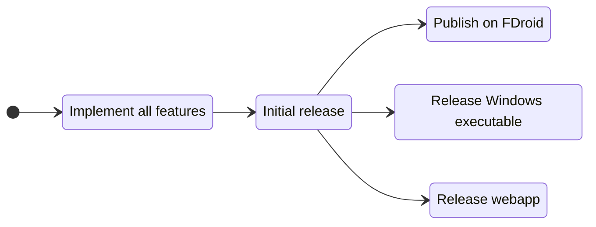

# Binary Toolset

A Flutter app that provides a collection of binary tools for developers.

## Features

- Number bases conversion (binary, octal, decimal, hexadecimal)
- Calculator between binary, octal, decimal, hexadecimal numbers
- Signed and unsigned integer representation with different bases
- IEEE 754 floating point representation (32-bit and 64-bit)

## How to install

For now the app is not available on the app store, but you can [build it yourself](#build-it-yourself) or join the beta testing program on Firebase.
To do so, click on the following link and follow the instructions: [Join the beta testing program](https://appdistribution.firebase.dev/i/6f8086369f7383c4)

## Build it yourself

To build the app yourself, you need to have Flutter installed on your machine. If you don't have it, you can follow the instructions on the [official website](https://flutter.dev/docs/get-started/install).
Make sure to also install Android dependencies if you want to build the app for Android. After that, you can clone the repository and run the following commands:

```bash
flutter pub get
flutter run
```

or if you want to build the app for Android:

```bash
flutter build apk
```

## Upcoming features

- [x] Number bases converter
- [ ] Calculator
- [ ] Signed numbers
- [ ] IEEE 754

## Roadmap

